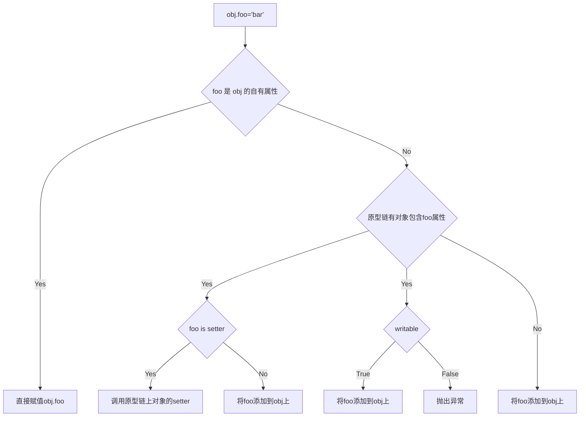

## 对象

JavaScript 中只有对象，没有类

### 语法 

**创建对象**
- 文字形式（常用，不是**字面量**）
- 构造形式(构造函数)

``` js
const myObj = {
  key: value
}

const myObj = new Object()
myObj.key = value
```

### 类型

- 简单类型: `number`, `string`, `boolean`, `symbol`
- 特殊类型: `null`, `undefined`
- 复杂类型: `object`

### 内置对象(函数)

> `String`, `Number`, `Boolean`, `Symbol`, `Object`, `Function`, `Array`, `Map`, `Set`, `Date`, `RegExp`, `Error`

引擎会自动把简单类型的**字面量**转换为相应的对象


```js
'im a string'.length    // 11
'im a string'.chatAt(2) // 'm'
42.359.toFixed(2)       // '42.36'
```

- `null`, `undefined` 没有构造形式
- `Date`, `Map`, `Set` 只有构造形式
- `Object`, `Array`, `Function`, `RegExp` 文字形式也只是对象，不是字面量
- `Error` 可以用构造形式创建，也可以配合 `throw`

### 内容

存储在对象容器内部的是这些属性的名称，它们就像指针（从技术角度来说就是引用）一样，指向这些值真正的存储位置。

#### 访问内容

- `.a` 属性访问
- `['a']` 键访问

键访问可以接受任意UTF-8/Unicode字符串作为属性名 e.g. `obj['super-Fun!']`
键访问的字符串可以动态创建 `obj[variable]`
对象的属性名只能是字符串其他类型会自动转为字符串，数组除外

#### 可计算属性名 ES6

``` js
var prefix = 'foo'

var myObject = {
  [prefix + 'bar']: 'hello', 
  [prefix + 'baz']: 'world'
};

myObject['foobar'] // hello
myObject['foobaz'] // world

var myObject = {
  [Symbol.Something]: 'hello world'
}
```


JavaScript 中对象的属性如果是一个函数，不应该被叫做方法。它并不保存在这个对象中，只是通过引用绑定在一起。无论是什么类型的属性都应该称为属性。

#### 数组

数组只能通过`[]`键访问，并且期望键的值为非负整数。数字自动判断键值进行转换

``` js
var a = [1, 2, 3, 4]
console.log(a[2]) // 3
a['2'] = 4 // 自动转为数字
console.log(a) // [1, 2, 4, 4]
a[-1] = 13
a['foo'] = 20
console.log(a) // [1, 2, 4, 4, -1:13, foo: 20]
console.log(a.length) // 4
```

::: info
- 数组和普通的对象都根据其对应的行为和用途进行了优化，所以最好只用对象来存储键/值对，只用数组来存储数值下标/值对。
- 数组可以存储普通的键/值对象，但不会改变长度
:::

#### 复制对象

JavaScript 没有定义好的复制函数，因为语言内部引用机制复杂。

``` js
function anotherFunction() { /*..*/ }

var anotherObject = { 
    c: true
}

var anotherArray = [];

var myObject = { 
    a: 2,
    b: anotherObject, // 引用，不是复本！ 
    c: anotherArray, // 另一个引用！
    d: anotherFunction
};

anotherArray.push( anotherObject, myObject );
```

- **深复制**
  - 在保障JSON安全的情况下 `JSON.parse(JSON.stringify(obj))`

- **浅复制**
  - `Object.assign({}, obj)`

#### 属性描述符

> 用来检测属性特性的方法，比如判断属性是否是只读

``` js
var myObject = { 
    a:2
};

Object.getOwnPropertyDescriptor( myObject, "a" ); 
// {
//    value: 2,
//    writable: true,
//    enumerable: true,
//    configurable: true
// }
Object.defineProperty( myObject, "a", {
    value: 2,
    writable: false, // not writable! 
    configurable: true,
    enumerable: true
} )
```

- **writable**: 决定是否可以修改属性的值
  - 严格模式 `TypeError`
  - 非严格模式 **静默失败(silently failed)**

::: info
可以把writable:false看作是属性不可改变，相当于你定义了一个空操作setter。严格来说，如果要和writable:false一致的话，你的setter被调用时应当抛出一个TypeError错误。
:::

- **enumerable**: 控制的是属性是否会出现在对象的属性枚举中
- **configurable**: 只要属性是可配置的，就可以使用defineProperty(..)方法来修改属性描述符
  - 不管是不是处于严格模式，尝试修改一个不可配置的属性描述符都会出错

::: info
- 要注意有一个小小的例外：即便属性是configurable:false， 我们还是可以把writable的状态由true改为false，但是无法由false改为true。
- configurable:false还会禁止删除这个属性
:::

#### 不变性


针对属性的操作

``` js
var myObject = {}

Object.defineProperty(myObject, "FAVORITE_NUMBER",{
  value: 42,
  writable: false,
  configurable: false 
})
```

针对对象的操作 

|Method|enumerable|writable|configurable|isExtensible|isSealed|isFrozen|
|:---|:---|:---|:---|:---|:---|:---|
|`o = {a: 1}`|`true`|`true`|`true`|`true`|`false`|`false`|
|禁止扩展`Object.preventExtensions`|`true`|`true`|`true`|`false`|`false`|`false`|
|密封`Object.seal`|`true`|`true`|`false`|`false`|`true`|`false`|
|冻结`Object.freeze`|`true`|`false`|`false`|`false`|`true`|`true`|


::: info

- `Object.freeze` > `Object.seal` > `Object.preventExtensions` 无法逆向操作，设置`writable:false`属性无法重新定义属性
- 在**非严格模式**下，针对值为`false` 的操作会静默失败。在**严格模式**下，将会抛出`TypeError`错误

- 所有的方法创建的都是浅不变性，目标对象引用了其他对象不受影响
- 结合 `writable:false` 和 `configurable:false` 就可以创建一个真正的常量属性
:::

### 存在性

- `in`: in操作符会检查属性是否在**对象**及其`[[Prototype]]`**原型链**中
- `hasOwnProperty(..)`: 只会检查属性是否在**对象**中

:::warning
- 通过`Object.create(null)`创建的对象没有原型链需要用 `Object.prototype.hasOwnProperty.call(obj, name)` 检查
- `4 in [1, 2, 4]` 并不返回 `true`. 实际上的操作类似 `'4' in { '0': 1, '1': 2, '2': 4 }` 返回的是 `false`
:::

**枚举**

`obj.propertyIsEnumerable`: hasOwnProperty && enumerable
`Object.keys` 会返回一个数组，包含所有可枚举属性
`Object.getOwnPropertyNames`: 会返回一个数组，包含所有属性，无论它们是否可枚举

以上三种方法都只针对**对象本身**，不会查找原型链

**遍历**

- 键遍历 `for`, `for in` 得到的是指向值的地址，再查到地址得到值
- 值遍历 `for of` 直接得到值

::: info
- 数组有内置迭代器`@@iterator` 可以直接使用 `for of` 遍历，也可以手动遍历

  ``` js
  var myArray = [ 1, 2, 3 ];
  // myArray[Symbol.iterator] 获取 `@@iterator` 属性
  var it = myArray[Symbol.iterator]();

  it.next(); // { value:1, done:false }
  it.next(); // { value:2, done:false }
  it.next(); // { value:3, done:false }
  it.next(); // { done:true } // 第四次才结束
  ```

- 对象默认不支持值遍历，但是可以通过 `defineProperty` 和**文字形式声明**完成支持

  ``` js
  Object.defineProperty( myObject, Symbol.iterator, { 
      enumerable: false,
      writable: false,
      configurable: true,
      value: function() { 
          var o = this;
          var idx = 0;
          var ks = Object.keys( o ); 
          return {
              next: function() {
                  return {
                      value: o[ks[idx++]], 
                      done: (idx > ks.length)
                  }; 
              }
          }; 
      }
  } )

  var randoms = {
      [Symbol.iterator]: function() {
          return {
              next: function() {
                  return { value: Math.random() }; 
              }
          }; 
      }
  };
  ```
:::

## 原型

所有普通的`[[Prototype]]`链最终都会指向内置的`Object.prototype`




::: info
- `Object.defineProperty(..)` 不会受到原型对象的 writable 只有 `=` 赋值会受影响
- `obj.foo++` 会发生隐式屏蔽，即 `obj.foo = protoObj.foo + 1`
:::

### "类"

JavaScript 是少有的不通过类就能创建对象的语言。在JavaScript 中没有类，对象直接定义自己的行为

所谓的“原型继承”应该被表述为**委托**, JavaScript会在两个对象之间创建一个关联, 一个对象可以通过这个委托关联访问另一个对象的属性和函数

``` js
function Foo() { /* .. */ }

Foo.prototype = { /* .. */ }; // 创建一个新原型对象

// 需要在 `Foo.prototype` 上“修复”丢失的.constructor属性, 否则通过 Foo 创建的对象 constructor 会指向 Object
Object.defineProperty( Foo.prototype, "constructor" , {
    enumerable: false,
    writable: true,
    configurable: true,
    value: Foo // 让.constructor指向Foo
} )
```

> “构造函数”和“原型”这两个词默认只有松散的定义，实际的值可能适用也可能不适用。最好的办法是记住 “constructor 并不表示（对象）被（它）构造”

:::info

可以看到，就算是constructor这样相当“面向对象”的名字在 JavaScript 里和其他的函数以及对象都没有任何区别。你可以随意添加和修改。

:::

原型模式

``` js
// good ES6语法
Object.setPrototypeOf(Bar.prototype, Foo.prototype)

// good: ES6 之前，丢弃了 Bar.prototype 这个原始对象, 损失了一些性能(丢弃对象的垃圾回收)，但可读性好
Bar.prototype = Object.create(Foo.prototype)

// bad: 并没有创建对象，Bar创建的对象的[[prototype]]还是指向 Foo.prototype
Bar.prototype = Foo.prototype

// bad: Foo 实例化带来的副作用会传递给 Bar 创建的对象
Bar.prototype = new Foo()

```

### __proto__

.__proto__ 实际上并不存在于你正在使用的对象中, 而是在内置的 Object.prototype 中。它的实现类似于 

```js
Object.defineProperty( Object.prototype, "__proto__", {
  get: function() {
    return Object.getPrototypeOf( this );
  },
  set: function(o) {
    // ES6 中的 setPrototypeOf(..)
    Object.setPrototypeOf( this, o );
    return o;
  }
} );

```

> 因此，访问（获取值）`a.__proto__` 时，实际上是调用了 `a.__proto__()`（调用 getter 函数）。虽然 getter 函数存在于 `Object.prototype` 对象中，但是它的 this 指向对象 a，所以和 `Object.getPrototypeOf(a)` 结果相同。


> 内部委托比起直接委托可以让 API 接口设计更加清晰

``` js
var anotherObject = { 
    cool: function() {
        console.log( "cool!" );
    }
};

var myObject = Object.create( anotherObject );

myObject.doCool = function() { 
    this.cool(); // 内部委托！
};

myObject.doCool(); // "cool!"
```

## 行为委托

如果在第一个对象上没有找到需要的属性或者方法引用，引擎就会继续在 [[Prototype]]
关联的对象上进行查找。同理，如果在后者中也没有找到需要的引用就会继续查找它的
[[Prototype]]，以此类推。这一系列对象的链接被称为“原型链”。**原型链**代表的是一种不同于**类**的设计模式

换句话说，JavaScript 中这个机制的本质就是对象之间的关联关系。

**面向类(对象)**

``` js
class Task {
  id;
  // 构造函数 Task()
  Task(ID) { id = ID; }
  outputTask() { output( id ); }
}
class XYZ inherits Task {
  label;
  // 构造函数 XYZ()
  XYZ(ID,Label) { super( ID ); label = Label; }
  outputTask() { super(); output( label ); }
}

xyz = new XYZ(1, 'xyz')
```

**对象关联(OLOO objects linked to other objects**

``` js
Task = {
  setID: function (ID) { this.id = ID },
  outputID: function () { console.log(this.id) }
}

// 让 XYZ 委托 Task
XYZ = Object.create(Task)

XYZ.prepareTask = function (ID, Label) {
  this.setID(ID)
  this.label = Label
}

XYZ.outputTaskDetails = function () {
  this.outputID()
  console.log(this.label)
}

const xyz = Object.create(XYZ)
xyz.prepareTask(1, 'xyz')
```

> 这是一种极其强大的设计模式，和父类、子类、继承、多态等概念完全不同。在你的脑海中对象并不是按照父类到子类的关系垂直组织的，而是通过任意方向的委托关联并排组织的。

**内省**

对象关联风格有更简洁清晰的**内省**，相对“原型继承”, instanceof 无法判断两个**对象**的关系

``` js
// 让 Foo 和 Bar 互相关联
Foo.isPrototypeOf( Bar ); // true
Object.getPrototypeOf( Bar ) === Foo; // true
// 让 b1 关联到 Foo 和 Bar
Foo.isPrototypeOf( b1 ); // true
Bar.isPrototypeOf( b1 ); // true
Object.getPrototypeOf( b1 ) === Bar; // true
```

## Class


优点
- 简化了语法

缺点
- 从机制上不支持成员属性(静态属性)
- super 是静态绑定，如果动态绑定还需要额外的语法。


根本上它还是原型的语法糖，并不一个纯粹的静态声明。因为JavaScript没有“类”. class是纯粹的静态语言语法，但 JavaScript 是动态语言。
